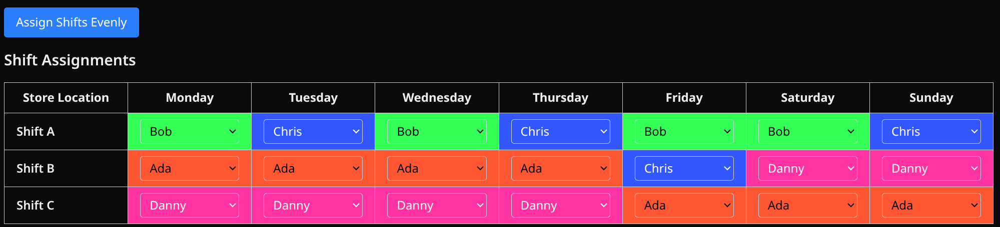

# Shift Scheduler

This project aims to provide a convenient way for small business owners to assign shift to employees.

When assigning shifts, priority is given to employees who have the least assigned shift.

<mark>The shift assignment algorithm might have issues and reject valid time, please create an issue so we can improve it together!</mark>

Start using from [this github page](https://johnyeung-dojjy.github.io/ShiftScheduler/)! All data are stored locally.

## Default homepage


## Add your own data in "Edit Confiturations"


## Add employees ( <28 entries)


## Click the assign "Assign Shifts Evenly" button!



<hr>

This is a [Next.js](https://nextjs.org) project bootstrapped with [`create-next-app`](https://nextjs.org/docs/app/api-reference/cli/create-next-app).

## Host it yourself!

First, run the development server:

```bash
npm run dev
# or
yarn dev
# or
pnpm dev
# or
bun dev
```

Open [http://localhost:3000](http://localhost:3000) with your browser to see the result.
